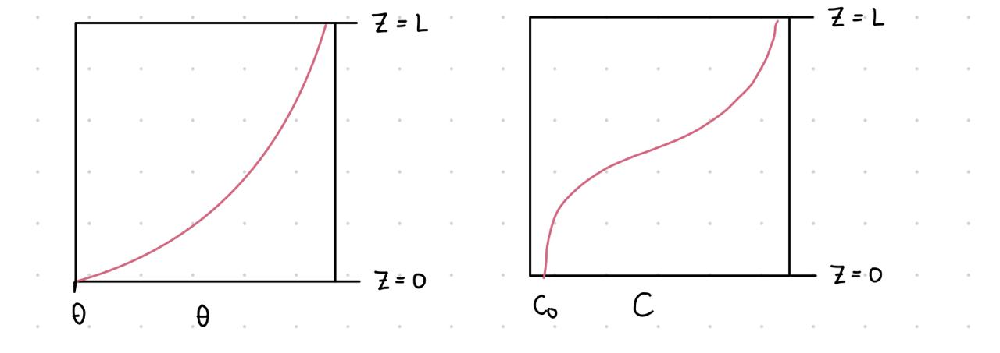

# Transporte_de_Contaminantes_IIQ2003_25
DESCRIPCIÓN DEL PROYECTO
    Actualmente Chile se encamina a una transición sustentable dados los objetivos planteados por la ONU y la COP, por ello, es de sumo interés para políticas públicas y el sector privado tener una forma de evaluar el transporte de contaminantes en suelos producto de los relaves. Al ser el principal sostén económico del país, está sujeto a cambios en el marco regulatorio y futuros proyectos de reactivación o traslado de relaves abandonados. En particular, se estudió El Tranque Relave 2 de Puerto Cristal (abandonado), ubicado en la región de Aysén de Chile, siendo de gran relevancia por su impacto ambiental en la pérdida de biodiversidad y cultural. Se estudiará específicamente el desecho de plomo (Pb) en condiciones de lluvia continua en un período de 7 días en invierno. 

DESCRIPCIÓN DEL MODELO FÍSICO 
    Se hará uso de la ecuación de Richards para modelar el transporte de momemtum, que considera la acumulación volumétrica de agua producto los cambios en la altura de presión (succión), la cual se conecta intrínsecamente con la Ley de Darcy al considerar un flujo de infiltración por lluvias (sin evaporación). Por otro lado, la ecuación de transporte de soluto modela el transporte difusivo y convectivo de la especie contaminante en la columna de control, acoplada a la ecuación de Richards mediante el contenido volumétrico de agua. Se toma una columna de control donde se estudia el cambio de las propiedades en la coordenada z (positiva hacia arriba) y flujo positivo hacia arriba (por Ley de Darcy). Se escoge Z=0 superficie y Z=L fondo de la columna, a continuación un esquema del perfil modelado:

Condicion inicial: En t=0 hay humedad inicial θ_0 => h0
Condicion de borde 1: Flujo impuesto en z=0, q0
Condicion de borde 2: Cabezal de presión cte en el fondo z=L, h_{fondo} = h0
Condicion de borde 3: Concentración inicial arrastrada con el agua en superficie, C(0,t)=C_{top}
Condicion de borde 4: Contaminante sale arrastrado solo por convección, dC/dz = 0 para z = L 

Se realizan los siguiente supuestos:
1) membrana totalmente permeable en el fondo.
2) Flujo en régimen laminar (Validez de la ley de Darcy).
3) Solo hay flujo y difusión unidireccional (en z).
4) Medio poroso.
5) Fluido incompresible.
6) Propiedades termofísicas constantes.
7) Gradientes de presión en x e y despreciables.
8) No hay reacción de los contaminantes
9) Soluto se encuentra muy diluido
10) LLuvia igual (constante)
11) Relave de Pb-Zn arenoso-limoso
12) Se asume que no hay soluto inicialmente en el relave para estudiar el transporte a través de este.
13) Se asume concentraciones iniciales de Pb y Zn dada la falta de información
14) Se asume que el caudal promedio (q_adv_tracer en código) es igual al caudal impuesto.
15) No hay evaporación.
16) Humedad inicial estimada a partir de un 30 % de la humedad saturada θ_s dado por un clima frío.
17) No se forma un exceso de agua en la superficie del relave.
    

DESCRIPCIÓN DEL MÉTODO NÚMERICO
    Para resolver la ecuación de Richards se utiliza Backward Euler y Picard en un solo paso mediante un esquema implícito. Para ello, primero debemos linealizar los términos no lineales que multiplican a las variables h_{i}^{j+1},h_{i-1}^{j+1},h_{i+1}^{j+1} mediante h^{viejo}=h^j, lo que permite calcular θ,C y K. Congelamos estos valores y armamos h^{j+1} mediante solución lineal. (NO SE CÁLCULA error de h^j== h^{j+1}). Se resuelve el sistema lineal Ah^{j+1} = rhs en cada paso temporal y se repite el proceso.

Para el transporte de contaminantes solo se utiliza Backward Euler ya que θ es conocido de Richards, aquí se resuelve el sistema lineal AC^{j+1} = rhs para cada paso temporal y se repite el bucle para cada θ.

Cabe destacar que ambas ecuaciones fueron discretizadas por diferencias finitas conservativas.

INSTRUCCIONES PARA EJECUTAR
    Si esta en jupyter notebook, diríjase a main.ipynb > run > run all cells
Si está en otra terminal como VS code verifique tener instaladas las librerías numpy y matplotlib, caso contrario, instalar según la documentación del terminal y las características del dispositivo (mac, linux o windows). Ejecute el archivo main.ipynb

En el código main.ipynb en el punto 5) podrá notar que el código para guardar los graficos esta puesto como un ''comentario'', debe sacarle las comillas en caso de querer descargar los gráficos para otra configuración de datos. 

RUTA POR REPOSITORIO
En la carpeta resultados_gráficos_svg se encuentran los siguientes resultados de main,ipynb:
    perfil_CC0.svg Muestra el gráfico de transporte adimensional C/C0 vs la profundidad del relave en cada día.
    Zn_vs_profundidad.svg Muestra el gráfico de transporte de zinc (Zn) vs la profundidad del relave en cada día.
    Pb_vs_profundidad.svg Muestra el gráfico de transporte de Plomo (Pb) en mg/L vs la profundidad del relaveen cada día.
    theta_vs_profundidad.svg Muestra el gráfico de transporte de momemtum, la cantidad volumétrica de agua θ vs la profundidad del relave en cada día.

Por otro lado la carpeta esquema contiene la imagen del perfil modelado (simplificado)
    
En cuanto al archivo .gitignore se utilizó para que no aparezcan los autosaves de jupyter en git status, ignora los .ipynb_checkpoints
